  
  

    
    
    
    
    
    
    
    
    
    
    
    
    
  

 
<h1>✨ About me</h1>

🐍 I am 20 yo Python developer

💼 I am looking for my first job as a Backend developer

📚 Currently expanding my knowladge at everything development related

☕ Coffee is the thing keeping me alive

🎭 Funny conventions is another thing that brings me joy

<h2>🔗 My contacts</h2>

  
  
    

